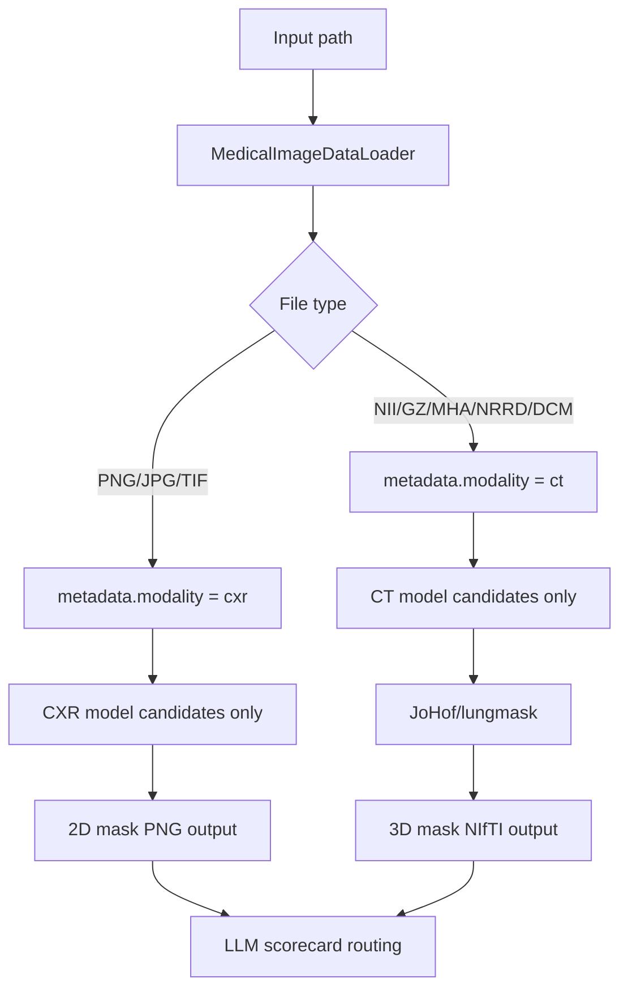

# CT 데이터셋 확장 정리

## 현재 지원 범위

- CXR 입력은 기존처럼 `.png`, `.jpg`, `.jpeg`, `.bmp`, `.tif`, `.tiff`를 사용한다.
- CT volume 입력은 `.nii`, `.nii.gz`, `.mha`, `.mhd`, `.nrrd`, `.dcm` 확장자를 인식한다.
- 입력 파일 확장자로 `modality`를 자동 판별한다.
  - 2D 이미지: `cxr`
  - CT volume: `ct`
- 오케스트레이터는 샘플 metadata의 `modality`를 사용해서 CXR 모델과 CT 모델이 후보 목록에서 섞이지 않게 한다.

## 활성화된 CT 모델

현재 CT에서 바로 실행 후보로 활성화된 모델은 다음과 같다.

- `JoHof_lungmask`
  - 원본: `JoHof/lungmask`
  - 대상 장기: `lung`, `left_lung`, `right_lung`
  - 입력: CT volume
  - 출력: 3D binary lung mask
  - 저장 형식: `.nii.gz`
- `wasserth_TotalSegmentator_lung`
  - 원본: `wasserth/TotalSegmentator`
  - 대상 장기: `lung`
  - 입력: CT volume
  - 출력: 5개 lung lobe label union mask
  - 저장 형식: `.nii.gz`
- `wasserth_TotalSegmentator_heart`
  - 원본: `wasserth/TotalSegmentator`
  - 대상 장기: `heart`
  - 입력: CT volume
  - 출력: heart label mask
  - 저장 형식: `.nii.gz`

다음 CT 모델들은 registry에는 남아 있지만 아직 실행 후보는 아니다.

- `imlab-uiip_lung-segmentation-3d`
- `rezazad68_BCDU-Net`
- `imlab-uiip_lung-segmentation-3d`
- `knottwill_UNet-Small`

이 모델들은 원본 환경, weight loader, preprocessing 차이가 있어서 추가 adapter 검증 후 활성화해야 한다.

## 실행 예시

```powershell
python model_comparison\main.py `
  --image-dir path\to\ct_volumes `
  --query "폐 CT 분할해줘" `
  --target-organ lung `
  --top-k 8 `
  --limit 1 `
  --output-dir outputs\ct_lung_run `
  --chroma-dir chroma_db\ct_lung_run `
  --skip-average
```

CT 폐 입력이 들어오면 실행 가능한 후보는 `JoHof_lungmask`, `wasserth_TotalSegmentator_lung`이다. CT 심장 입력이 들어오면 실행 가능한 후보는 `wasserth_TotalSegmentator_heart`이다. 결과 mask와 consensus mask는 `.nii.gz`로 저장된다.

## TotalSegmentator v2 로컬 데이터셋

현재 로컬 데이터셋 경로:

```text
C:\Users\eunhe\Downloads\ct_data
```

구조는 다음과 같다.

```text
ct_data/
  s0004/
    ct.nii.gz
    segmentations/
      heart.nii.gz
      lung_upper_lobe_left.nii.gz
      lung_lower_lobe_left.nii.gz
      lung_upper_lobe_right.nii.gz
      lung_middle_lobe_right.nii.gz
      lung_lower_lobe_right.nii.gz
```

로더는 `segmentations` 폴더를 입력 CT 후보에서 제외하고, 각 subject의 `ct.nii.gz`만 입력으로 사용한다. GT가 필요할 때는 `target_organ=lung`이면 5개 lung lobe mask를 union하고, `target_organ=heart`이면 `heart.nii.gz`를 사용한다.

실제 smoke test에는 장기 mask가 있는 `s0004`를 사용했다.

```powershell
python model_comparison\main.py `
  --image-dir C:\Users\eunhe\Downloads\ct_data `
  --query "폐 CT 분할해줘" `
  --target-organ lung `
  --top-k 8 `
  --limit 1 `
  --split-file configs\ct_totalsegmentator_smoke_split.json `
  --split-name smoke `
  --output-dir outputs\ct_totalsegmentator_lung_smoke_20260512 `
  --chroma-dir chroma_db\ct_totalsegmentator_lung_smoke_20260512 `
  --skip-average
```

초기 smoke test 결과:

- 실행 모델: `JoHof_lungmask`
- 선택 모델: `JoHof_lungmask`
- GT: TotalSegmentator lung lobe union
- DSC: `0.9838732955`
- IoU: `0.9682584772`
- 선택 mask: `outputs\ct_totalsegmentator_lung_smoke_20260512\s0004_JoHof_lungmask_mask.nii.gz`

후보 확장 후 CT 폐 smoke test 결과:

- 실행 모델: `JoHof_lungmask`, `wasserth_TotalSegmentator_lung`
- 선택 모델: `wasserth_TotalSegmentator_lung`
- GT 기준 best DSC 모델: `JoHof_lungmask`
- `JoHof_lungmask` DSC / IoU: `0.9838732955` / `0.9682584772`
- `wasserth_TotalSegmentator_lung` DSC / IoU: `0.9420653394` / `0.8904759193`
- 선택 mask: `outputs\ct_lung_expanded_smoke_20260512\s0004_wasserth_TotalSegmentator_lung_mask.nii.gz`

후보 확장 후 CT 심장 smoke test 결과:

- 실행 모델: `wasserth_TotalSegmentator_heart`
- 선택 모델: `wasserth_TotalSegmentator_heart`
- `wasserth_TotalSegmentator_heart` DSC / IoU: `0.9087870075` / `0.8328227520`
- 선택 mask: `outputs\ct_heart_expanded_smoke_20260512\s0004_wasserth_TotalSegmentator_heart_mask.nii.gz`

## 필요한 패키지

CT 실행에는 다음 패키지가 필요하다.

```powershell
pip install SimpleITK lungmask
pip install TotalSegmentator nibabel
```

`lungmask`는 첫 실행 때 모델 weight를 자체 cache로 받을 수 있다. 네트워크가 막혀 있으면 weight 다운로드를 먼저 해결해야 한다.

## 코드 흐름


