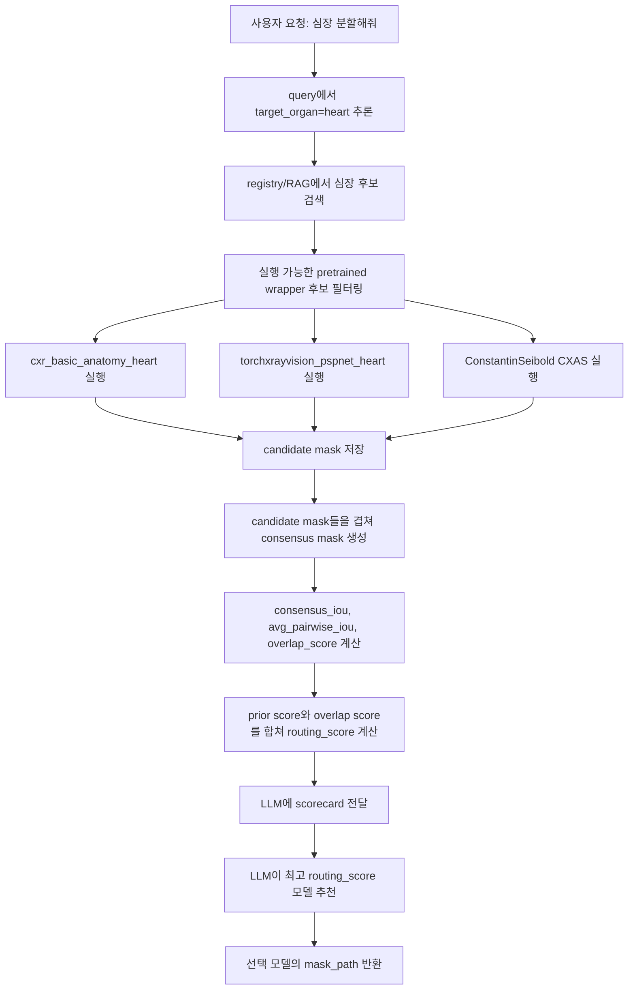

# CXAS 심장 분할 어댑터 및 LLM 오케스트레이터 연결 정리

## 1. 이번에 해결한 문제

`cxas`는 `jsonschema<4`, `pydicom==2.0.0`, 낮은 `numpy` 조합을 끌고 와서 메인 환경에 직접 설치하면 `chromadb`, `langchain-community`, `opencv-python-headless`와 충돌한다. 그래서 메인 파이프라인에서 직접 `import cxas`하지 않고, 별도 conda 환경(`cxas_env`)을 subprocess로 호출하는 구조로 분리했다.

현재 심장 분할 후보 중 `ConstantinSeibold/ChestXRayAnatomySegmentation`은 실제 pretrained weight가 다운로드되어 실행 가능해졌고, LLM scorecard에도 들어간다.

## 2. 사용 모델

| registry 이름 | 원본 모델명 | 구조 | weight 상태 | 현재 상태 |
|---|---|---|---|---|
| `ConstantinSeibold_ChestXRayAnatomySegmentation` | `ConstantinSeibold/ChestXRayAnatomySegmentation UNet_ResNet50_default` | ResNet50 encoder 기반 U-Net 계열 multi-label CXR anatomy segmentation | `cxas`가 Google Drive에서 `UNet_ResNet50_default.pth` 다운로드 | subprocess adapter 구현 및 활성화 |

CXAS 출력은 `(1, 159, 512, 512)` boolean multi-label mask이고, 원본 이미지 크기로 resize한 뒤 심장 관련 채널을 union한다.

현재 심장 채널:

- `121`: heart
- `122`: heart atrium left
- `123`: heart atrium right
- `124`: heart myocardium
- `125`: heart ventricle left
- `126`: heart ventricle right

## 3. 환경 구성 메모

메인 환경에는 `cxas`를 설치하지 않는다. `cxas_env` 안에서만 설치한다.

실제 확인된 보정 사항:

```powershell
conda run -n cxas_env python -m pip install matplotlib
conda run -n cxas_env python -m pip install gdown==5.2.0
```

필요한 환경 변수:

```powershell
$env:CXAS_PATH='C:\Users\eunhe\GitHub\AS_LAB\LLM_Project\model_assets\cxas'
```

`CXAS_PATH`를 지정하지 않으면 Windows에서 `HOME` 처리 문제나 사용자 홈 캐시 위치 문제를 만날 수 있다. 현재 weight는 아래 경로에 있다.

```text
C:\Users\eunhe\GitHub\AS_LAB\LLM_Project\model_assets\cxas\.cxas\weights\UNet_ResNet50_default.pth
```

`model_assets/`는 `.gitignore`에 추가해서 대용량 weight가 Git에 들어가지 않도록 했다.

## 4. PyTorch checkpoint 로딩 이슈

`cxas==0.0.17`은 내부에서 `torch.load(path)`를 그대로 호출한다. 그런데 PyTorch 2.6 이후 기본값이 `weights_only=True`가 되면서, 공식 checkpoint 안의 `argparse.Namespace` 때문에 로딩이 실패한다.

따라서 adapter script에서만 아래 방식으로 공식 CXAS checkpoint를 신뢰하고 로딩한다.

```python
original_torch_load = torch.load

def _torch_load_compat(*load_args, **load_kwargs):
    load_kwargs["weights_only"] = False
    return original_torch_load(*load_args, **load_kwargs)

torch.load = _torch_load_compat
```

이 우회는 메인 파이프라인 전체에 적용하지 않고, `tools/run_cxas_mask.py` subprocess 내부에만 적용했다.

## 5. 추가/수정 파일

| 파일 | 역할 |
|---|---|
| `tools/run_cxas_mask.py` | `cxas_env` 안에서 CXAS 모델을 로드하고 target 채널을 binary mask PNG로 저장 |
| `model_comparison/vision_wrappers.py` | `ConstantinSeibold_ChestXRayAnatomySegmentation` wrapper를 subprocess 방식으로 연결 |
| `model_comparison/main.py` | prior score가 0인 신규 모델도 실행 가능하게 하고, 실행 후 overlap score로 routing score를 계산 |
| `configs/model_registry.json` | CXAS 모델의 `wrapper_status`를 `implemented`, `selection_enabled`를 `true`로 변경 |
| `.gitignore` | `model_assets/` 추가 |

## 6. 현재 LLM 오케스트레이터 흐름



GT가 없는 경우에도 `metrics`는 `null`로 두고, 모델별 mask overlap과 registry prior를 이용해서 선택한다.

## 7. 검증 결과

CXAS 단독 smoke test:

```powershell
$env:CXAS_PATH='C:\Users\eunhe\GitHub\AS_LAB\LLM_Project\model_assets\cxas'
conda run -n cxas_env python tools\run_cxas_mask.py `
  --image nih_sample_data\sample\images\00000013_005.png `
  --output outputs\cxas_smoke\00000013_005_cxas_heart_mask.png `
  --target heart
```

결과:

- output shape: `1024 x 1024`
- mask area fraction: `0.115177`
- output: `outputs\cxas_smoke\00000013_005_cxas_heart_mask.png`

전체 심장 파이프라인:

```powershell
$env:CXAS_PATH='C:\Users\eunhe\GitHub\AS_LAB\LLM_Project\model_assets\cxas'
python model_comparison\main.py `
  --image-dir nih_sample_data\sample\images `
  --query "심장 분할해줘" `
  --top-k 5 `
  --limit 1 `
  --output-dir outputs\overlap_agent_cxas_heart `
  --chroma-dir chroma_db\overlap_agent_cxas_heart `
  --skip-average
```

실행된 심장 후보:

| 모델 | prior score | overlap score | final routing score | 상태 |
|---|---:|---:|---:|---|
| `cxr_basic_anatomy_heart` | 0.9277 | 0.8389 | 0.8922 | selected |
| `torchxrayvision_pspnet_heart` | 0.7869 | 0.8898 | 0.8281 | success |
| `ConstantinSeibold_ChestXRayAnatomySegmentation` | 0.0000 | 0.8059 | 0.8059 | success |

최종 반환 mask:

```text
outputs\overlap_agent_cxas_heart\00000013_005_cxr_basic_anatomy_heart_mask.png
```

CXAS candidate mask:

```text
outputs\overlap_agent_cxas_heart\00000013_005_ConstantinSeibold_ChestXRayAnatomySegmentation_candidate_mask.png
```

폐 회귀 테스트도 통과했다. `폐 분할해줘` 요청에서는 기존처럼 `cxr_basic_anatomy_lung`과 `torchxrayvision_pspnet_lung`이 실행되고, 최종 선택은 `cxr_basic_anatomy_lung`이었다.

## 8. 남은 작업

1. `DIAGNijmegen/opencxr heart_seg`를 별도 환경 또는 메인 환경에서 안정적으로 설치하고 weight 다운로드까지 확인하면 활성화할 수 있다.
2. `HybridGNet`은 PyTorch Geometric, 공식 weight, contour-to-mask adapter가 필요하다.
3. CXAS는 현재 local validation prior가 0이므로, NIH/CheXmask 같은 검증 mask가 있으면 실제 DSC/IoU를 계산해 registry prior를 보정하는 것이 좋다.
4. 교수님 설명용으로는 “정확도 하나로 고정 선택”이 아니라 “각 모델이 만든 mask의 agreement와 모델 prior를 LLM scorecard로 넘겨 최종 선택”이라고 설명하면 된다.
