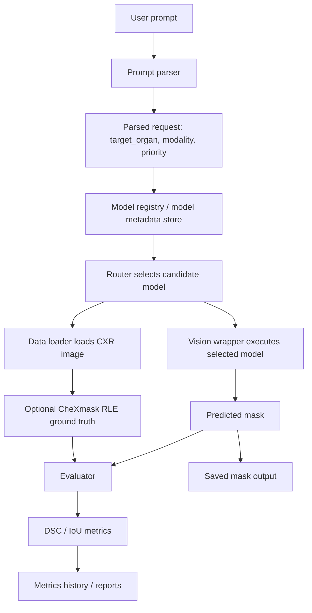
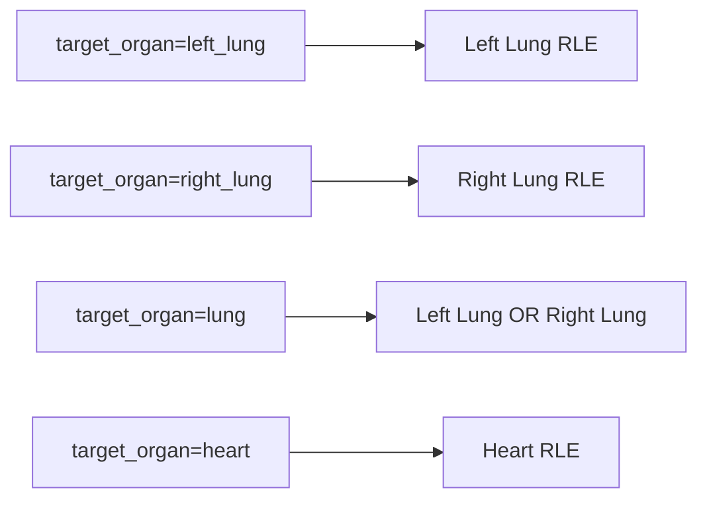

# CXR Segmentation Router 프레임워크 구조

## 목적

이 프레임워크는 사용자의 자연어 CXR segmentation 요청을 분석해 적절한 vision segmentation 모델로 라우팅하고, 선택된 모델의 mask를 생성한 뒤 ground truth가 있을 경우 DSC/IoU로 평가한다.

현재 범위는 CXR 안에서 target을 확장하는 구조다.

지원 target:

- `lung`
- `left_lung`
- `right_lung`
- `heart`

확장 후보:

- `pneumothorax`
- `clavicle`
- `rib`
- `diaphragm`

CT/MRI로 모달리티를 넓히지 않고 CXR 내부 target을 확장한 이유는, 기존 pipeline 구조를 유지하면서 라우터의 핵심인 “프롬프트에 따른 target/model 선택”을 더 명확하게 보여줄 수 있기 때문이다.

## 전체 흐름



간단히 말하면 다음 순서로 동작한다.

1. 사용자 prompt 입력
2. prompt에서 target, modality, priority 추출
3. model registry 또는 metadata store에서 후보 모델 검색
4. router가 모델 선택
5. image와 optional ground truth mask 로드
6. 선택된 vision wrapper로 segmentation 수행
7. predicted mask 저장
8. ground truth가 있으면 DSC/IoU 평가
9. metrics history와 report 생성

## 주요 모듈

| 영역 | 파일 | 역할 |
| --- | --- | --- |
| Prompt parsing | `segmentation_router/prompt_parser.py` | 자연어 prompt에서 target organ, modality, priority 추출 |
| Deterministic router | `segmentation_router/model_router.py` | `configs/model_registry.json` 기준 best model 선택 |
| Registry schema | `segmentation_router/model_registry.py` | model registry entry 검증 및 정규화 |
| Runtime pipeline | `model_comparison/main.py` | data loading, candidate retrieval, inference, evaluation 실행 |
| Runtime config | `model_comparison/config.py` | image path, mask path, target, top-k, output dir 관리 |
| Model metadata DB | `model_comparison/database_manager.py` | ChromaDB 또는 local fallback 기반 model metadata 검색 및 metric logging |
| LLM router | `model_comparison/llm_router.py` | Ollama/LangChain 기반 후보 모델 선택, 실패 시 fallback |
| Data loading | `model_comparison/data_loader.py` | image, file mask, split file, CheXmask RLE mask 로드 |
| Vision execution | `model_comparison/vision_wrappers.py` | model name에 따라 실제 wrapper 실행 |
| Evaluation | `model_comparison/evaluator.py` | DSC, IoU 계산 |
| Registry rebuild | `tools/build_registry_from_results.py` | metric history에서 `model_registry.json` 재생성 |
| Report generation | `tools/evaluate_router_report.py` | router/model 성능 요약 report 생성 |

## 데이터 계층

지원 image format:

- PNG
- JPG/JPEG
- BMP
- TIF/TIFF

지원 ground truth 방식:

- `mask_dir` 아래의 file-based mask
- Indiana dataset의 `leftMask`, `rightMask`, `single` 구조
- CheXmask RLE mask CSV (`ChestX-Ray8.csv`)

CheXmask target mapping:



`ChestX-Ray8.csv`는 큰 파일이기 때문에 전체를 메모리에 올리지 않는다. loader는 현재 image directory 또는 split에 포함된 image name만 기준으로 필요한 row를 streaming lookup한다.

## Routing 계층

프레임워크에는 두 가지 routing 경로가 있다.

## 1. Lightweight Registry Router

Entry point:

```text
segmentation_router.route_model(prompt, "configs/model_registry.json")
```

사용 위치:

- `demo_router.py`
- `inference/run_segmentation.py`
- route-only smoke test

선택 기준:

- 기본값: DSC 우선, IoU 보조, speed tie-break
- speed priority prompt: speed 우선, DSC/IoU 보조

예시:

```powershell
python inference\run_segmentation.py `
  --prompt "CXR heart segmentation" `
  --image nih_sample_data\sample\images\00000030_001.png `
  --route-only
```

## 2. Model Comparison Pipeline Router

Entry point:

```text
model_comparison/main.py
```

동작 순서:

1. `DatabaseManager`가 top-k candidate model metadata를 검색한다.
2. `LLMRouter`가 후보 중 하나를 선택한다.
3. LLM 호출 실패 또는 invalid model name 반환 시 fallback으로 DSC가 가장 높은 candidate를 선택한다.
4. ground truth가 있으면 후보 모델들을 실행하고 DSC/IoU를 기록한다.

## 모델 계층

현재 모델 family:

| Family | 예시 모델명 | 필요 dependency/asset | 설명 |
| --- | --- | --- | --- |
| CXR basic anatomy | `cxr_basic_anatomy_lung`, `cxr_basic_anatomy_heart` | `transformers`, `timm`, Hugging Face model cache | lung/heart 계열 pretrained anatomy mask |
| TorchXRayVision PSPNet | `torchxrayvision_pspnet_lung`, `torchxrayvision_pspnet_heart` | `torchxrayvision` | ChestX-Det PSPNet channel 선택 |
| SAM-Med2D | `sam_med2d_box_prompt` | local repo + checkpoint | optional promptable segmentation |
| Local baselines | `unet_lung`, `unet_lung_baseline`, `threshold_baseline` | local dependency만 필요 | smoke test와 baseline 비교에 유용 |
| MONAI wrappers | `segresnet_lung`, `attention_unet_lung` | `monai` | architecture wrapper, checkpoint 없으면 학습된 모델이 아님 |

## 새 모델 추가 방법

새 모델을 추가할 때는 아래 순서로 진행한다.

1. `configs/model_registry.json`에 model entry 추가
2. `model_comparison/database_manager.py`의 `MODEL_SPECS`에 metadata 추가
3. `model_comparison/vision_wrappers.py`에 wrapper 분기 추가
4. wrapper가 원본 image 크기와 같은 binary 2D mask를 반환하는지 확인
5. sample image로 smoke test 실행
6. ground truth가 있으면 DSC/IoU 기록 후 필요 시 registry 재생성

최소 registry entry 예시:

```json
{
  "name": "new_model_name",
  "target_organ": "heart",
  "modality": "cxr",
  "task_type": "segmentation",
  "metric_priority": "dsc",
  "validation_metrics": {
    "dsc": 0.0,
    "iou": 0.0
  },
  "runtime": {
    "speed": "medium",
    "device": "cuda"
  },
  "model_path": null,
  "output_suffix": "new_model_name_mask"
}
```

## 평가 및 출력

평가 지표:

- DSC
- IoU

주요 output:

- predicted mask: `output_dir`
- sample-level metric history: `metrics_history.jsonl`
- summary report: `tools/evaluate_router_report.py`로 생성
- updated registry: `tools/build_registry_from_results.py`로 생성

## 추천 실행 명령

Route-only smoke test:

```powershell
python inference\run_segmentation.py `
  --prompt "CXR heart segmentation" `
  --image nih_sample_data\sample\images\00000030_001.png `
  --route-only
```

CheXmask pipeline smoke test:

```powershell
python model_comparison\main.py `
  --image-dir nih_sample_data\sample\images `
  --chexmask-csv ChestX-Ray8.csv `
  --target-organ lung `
  --query unet_lung `
  --top-k 1 `
  --limit 1 `
  --output-dir outputs\chexmask_smoke_test
```

Router report 생성:

```powershell
python tools\evaluate_router_report.py `
  --input outputs\chexmask_smoke_test\metrics_history.jsonl `
  --output-dir outputs\chexmask_smoke_test
```

## 현재 설계의 경계

이 프레임워크는 아직 CT/MRI로 확장하지 않는다. 그 이유는 모달리티가 바뀌면 다음 요소들이 함께 커지기 때문이다.

- image geometry assumption
- preprocessing
- model architecture
- evaluation protocol
- 논문 scope

현재 단계에서 가장 자연스러운 확장 순서는 다음과 같다.

1. CheXmask 기반 `lung`, `left_lung`, `right_lung`, `heart` 평가 강화
2. SIIM-ACR 기반 `pneumothorax` 추가
3. ground truth가 확보되면 `clavicle`, `rib`, `diaphragm` 추가

## 한 줄 요약

현재 구조는 **CXR 이미지와 CheXmask annotation을 기반으로 target-aware segmentation model routing을 수행하는 프레임워크**다. 사용자는 자연어로 원하는 target을 말하고, router는 registry와 metric 정보를 바탕으로 적절한 segmentation model을 선택한다.
