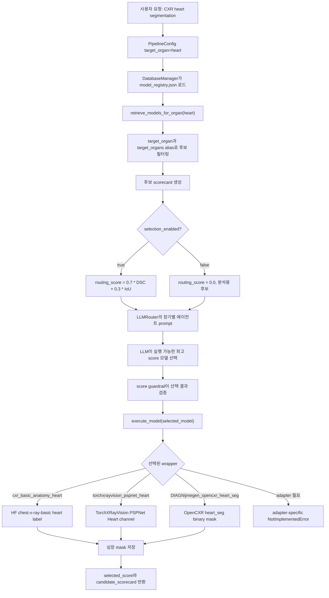

# CXR 심장/심장 음영 분할 모델과 LLM 에이전트 흐름

## 1. 목적

이 문서는 CXR 심장 또는 cardiac silhouette 분할을 위해 현재 코드와 `configs/model_registry.json`에 추가한 모델 후보를 정리한 문서이다.

교수님께서 요청하신 방향은 LLM이 단순히 정확도를 보고하는 것이 아니라, 각 타깃 장기별로 어떤 모델을 사용할지 판단하는 오케스트레이터 역할을 하는 것이다. 따라서 심장 에이전트는 다음 정보를 함께 보고 모델을 선택한다.

- 타깃 장기: `heart`, `cardiac`, `cardiac_silhouette`
- 원본 모델 이름과 출처
- 모델 구조
- pretrained weight 사용 가능 여부
- weight가 원본 repo 내부에 있는지, 외부 다운로드인지 여부
- 현재 코드에서 바로 실행 가능한지 여부
- 기존 검증 score인 DSC, IoU
- LLM routing score

현재는 실행 가능한 모델과 아직 adapter가 필요한 GitHub 모델을 분리했다. Adapter가 필요한 모델은 registry에는 등록하지만 `selection_enabled=false`로 두어, LLM이 후보로 참고만 하고 실제 mask 생성 모델로 선택하지 않도록 했다.

중요한 정정:

- 일부 원본 GitHub repository에는 weight 파일이 직접 들어있지 않다.
- 따라서 `pretrained_weight_available=true`는 “어딘가에서 받을 수 있음”을 뜻하며, “원본 repo 안에 바로 있음”을 뜻하지 않는다.
- 이 차이를 명확히 하기 위해 registry에 `weight_status`, `weight_action`을 추가했다.

## 2. 추가한 심장 분할 모델 후보

| Registry 이름 | 원본 모델명 | 모달리티 | 모델 구조 | weight 상태 | 현재 코드 상태 |
|---|---|---:|---|---|---|
| `cxr_basic_anatomy_heart` | `ianpan/chest-x-ray-basic` | CXR | EfficientNetV2 encoder + U-Net decoder | Hugging Face에서 다운로드, GitHub repo weight 아님 | 구현 완료 |
| `torchxrayvision_pspnet_heart` | `mlmed/torchxrayvision ChestX-Det PSPNet` | CXR | PSPNet 기반 CXR 해부학 구조 분할 | TorchXRayVision cache로 다운로드/로드 | 구현 완료 |
| `DIAGNijmegen_opencxr_heart_seg` | `DIAGNijmegen/opencxr heart_seg` | CXR | Keras U-Net 심장 분할 모델 | GitHub raw URL에서 `heart_seg.h5` 자동 다운로드 | wrapper 추가, package/weight 필요 |
| `ngaggion_HybridGNet` | `ngaggion/HybridGNet` | CXR | CNN + graph neural network 기반 contour 분할 | repo 내부 weight 없음, Google Drive 필요 | adapter 필요 |
| `ConstantinSeibold_ChestXRayAnatomySegmentation` | `ConstantinSeibold/ChestXRayAnatomySegmentation UNet_ResNet50_default` | CXR | U-Net ResNet50 기반 multi-label anatomy segmentation | repo 내부 weight 없음, `gdown`으로 Google Drive 다운로드 | adapter 필요 |

## 3. 모델별 원본 출처와 구조

### 3.1 `ianpan/chest-x-ray-basic`

- 출처: <https://huggingface.co/ianpan/chest-x-ray-basic>
- 현재 registry 이름: `cxr_basic_anatomy_heart`
- 역할: CXR에서 `right lung`, `left lung`, `heart`를 분할하는 anatomy segmentation 모델
- 구조:
  - `tf_efficientnetv2_s` encoder
  - U-Net decoder
  - segmentation head와 view/age/sex prediction head를 함께 가진 구조
- 현재 코드 상태:
  - 이미 `model_comparison/vision_wrappers.py`에 구현되어 있다.
  - `heart` 타깃일 때 label `3`을 선택해 심장 mask를 반환한다.
- 현재 선택 정책:
  - 실행 가능하고 score가 있으므로 `selection_enabled=true`
  - 심장 후보 중 현재 1순위로 선택된다.

### 3.2 `mlmed/torchxrayvision ChestX-Det PSPNet`

- 출처: <https://github.com/mlmed/torchxrayvision>
- 현재 registry 이름: `torchxrayvision_pspnet_heart`
- 역할: ChestX-Det 기반 CXR 해부학 구조 분할 모델에서 `Heart` channel을 사용
- 구조:
  - PSPNet 기반 segmentation model
  - CXR의 여러 해부학 구조를 동시에 예측
  - 현재 wrapper에서는 `Heart` channel index를 선택해 binary mask로 변환한다.
- 현재 코드 상태:
  - 이미 실행 wrapper가 있다.
  - `torchxrayvision.baseline_models.chestx_det.PSPNet()`을 로드한다.
- 현재 선택 정책:
  - 실행 가능하고 score가 있으므로 `selection_enabled=true`
  - `cxr_basic_anatomy_heart` 다음 후보로 사용된다.

### 3.3 `DIAGNijmegen/opencxr heart_seg`

- 출처: <https://github.com/DIAGNijmegen/opencxr>
- 현재 registry 이름: `DIAGNijmegen_opencxr_heart_seg`
- 역할: PA chest X-ray를 입력하면 심장 binary segmentation mask를 반환하는 OpenCXR 알고리즘
- 원본 코드 사용 방식:
  - `opencxr.load(opencxr.algorithms.heart_seg)`
  - `heartseg_algorithm.run(img_np)`
- 구조:
  - Keras U-Net
  - 입력 크기 `512 x 512 x 1`
  - depth `6`
  - batch normalization 사용
  - SELU activation
  - transposed convolution decoder
  - binary sigmoid output
- weight:
  - `heart_seg.h5`
  - OpenCXR package 내부에 없으면 GitHub raw URL에서 자동 다운로드하는 구조
- 현재 코드 상태:
  - `model_comparison/vision_wrappers.py`에 wrapper를 추가했다.
  - `pip install opencxr`가 필요하다.
  - 첫 실행 시 OpenCXR가 `heart_seg.h5`를 다운로드할 수 있다.
- 현재 선택 정책:
  - 아직 NIH/CheXmask 기준 local validation score를 계산하지 않았으므로 `selection_enabled=false`
  - 즉, LLM scorecard에는 표시되지만 현재는 실제 선택 후보에서 밀리도록 했다.

### 3.4 `ngaggion/HybridGNet`

- 출처: <https://github.com/ngaggion/HybridGNet>
- 관련 출처: <https://github.com/ngaggion/CheXmask-Database>
- 현재 registry 이름: `ngaggion_HybridGNet`
- 역할:
  - CXR에서 폐와 심장 contour를 해부학적으로 그럴듯하게 분할하는 모델
  - CheXmask-Database는 HybridGNet 기반으로 ChestX-ray8/NIH를 포함한 대규모 CXR mask를 제공한다.
- 구조:
  - CNN image feature extraction
  - graph neural network 기반 contour reasoning
  - 단순 pixel mask보다 shape plausibility를 강조하는 구조
- weight:
  - 원본 GitHub repository 내부에는 weight가 없다.
  - 원본 repository README의 Google Drive 링크에서 reproducibility weight를 따로 받아야 한다.
- 현재 코드 상태:
  - registry에는 추가했다.
  - 아직 PyTorch Geometric 환경, 외부 weight 다운로드, contour-to-mask 변환 adapter가 필요하다.
- 현재 선택 정책:
  - `selection_enabled=false`
  - adapter 구현 후 local score를 넣으면 선택 가능 후보로 바꿀 수 있다.

### 3.5 `ConstantinSeibold/ChestXRayAnatomySegmentation`

- 출처: <https://github.com/ConstantinSeibold/ChestXRayAnatomySegmentation>
- 현재 registry 이름: `ConstantinSeibold_ChestXRayAnatomySegmentation`
- 역할:
  - CXR fine-grained anatomy segmentation
  - Cardio-Thoracic Ratio, 즉 CTR 추출을 지원하므로 heart/cardiac silhouette 분석에 유용하다.
- 구조:
  - 기본 모델명: `UNet_ResNet50_default`
  - PAX-Ray++ 기반 multi-label anatomy segmentation
- 현재 코드 상태:
  - registry에는 추가했다.
  - 원본 repo 내부에 weight가 들어있는 구조가 아니라 `cxas` package가 Google Drive에서 weight를 다운로드한다.
  - 아직 `cxas` package 출력에서 heart label을 골라 binary mask로 변환하는 adapter가 필요하다.
- 현재 선택 정책:
  - `selection_enabled=false`
  - adapter와 local validation score가 생기면 선택 가능 후보로 전환할 수 있다.

## 4. 코드 변경 내용

### 4.1 Registry 수정

수정 파일:

- `configs/model_registry.json`

추가 또는 metadata 보강된 심장 후보:

- `cxr_basic_anatomy_heart`
- `torchxrayvision_pspnet_heart`
- `DIAGNijmegen_opencxr_heart_seg`
- `ngaggion_HybridGNet`
- `ConstantinSeibold_ChestXRayAnatomySegmentation`

각 모델에는 다음 정보를 넣었다.

- `original_name`
- `source_url`
- `architecture`
- `framework`
- `pretrained_weight_available`
- `wrapper_status`
- `selection_enabled`
- `target_organs`

### 4.2 Wrapper 수정

수정 파일:

- `model_comparison/vision_wrappers.py`

추가한 실행 경로:

```text
DIAGNijmegen_opencxr_heart_seg
-> _run_opencxr_heart_seg()
-> opencxr.load(opencxr.algorithms.heart_seg)
-> algorithm.run(image)
-> binary heart mask 반환
```

추가한 adapter guard:

- `ngaggion_HybridGNet`
- `ConstantinSeibold_ChestXRayAnatomySegmentation`

이 두 모델이 실수로 실행되면 generic error 대신 어떤 adapter가 필요한지 알려주는 `NotImplementedError`를 반환한다.

## 5. LLM 심장 에이전트 코드 흐름



## 6. 현재 선택 정책

현재 심장 에이전트가 실제로 선택할 수 있는 모델은 다음과 같다.

1. `cxr_basic_anatomy_heart`
2. `torchxrayvision_pspnet_heart`

OpenCXR, HybridGNet, CXAS는 원본 출처와 구조를 registry에 반영했지만, 아직 local validation score와 adapter가 부족하므로 분석용 후보로 둔다.

다음 작업을 하면 선택 가능 후보로 바꿀 수 있다.

1. OpenCXR 설치 후 NIH/CheXmask 기준으로 heart mask 성능을 계산한다.
2. `DIAGNijmegen_opencxr_heart_seg`의 `selection_enabled=true`로 변경하고 측정된 DSC/IoU를 넣는다.
3. HybridGNet weight를 다운로드하고 PyTorch Geometric adapter를 만든다.
4. CXAS package 출력에서 heart label을 추출하는 adapter를 만든다.

## 7. 교수님 설명용 요약

이제 심장 에이전트는 단순히 “정확도 숫자”를 출력하는 구조가 아니라, 심장 분할에 사용할 수 있는 모델 후보들을 scorecard로 받고 그중 가장 적합한 모델의 mask를 반환하는 오케스트레이터 구조가 되었다.

특히 CXR heart/cardiac silhouette 전용 또는 관련 모델을 registry에 원본 이름 기준으로 추가했다. 실행 가능한 모델은 바로 선택할 수 있게 두었고, 아직 adapter가 필요한 GitHub 모델은 LLM이 분석은 하되 실제 선택은 하지 않도록 막아두었다. 따라서 GT가 없는 inference 상황에서도 LLM은 심장이라는 타깃 장기에 맞는 후보군을 보고, 현재 사용 가능한 최고 score 모델을 선택해 mask를 반환한다.
