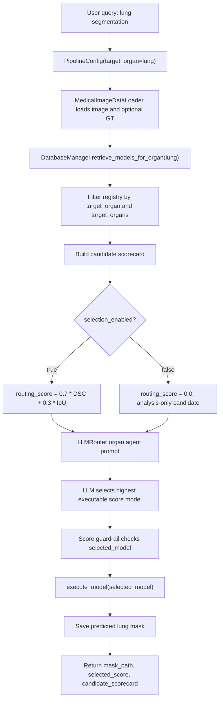

# GitHub Lung Segmentation Models and Agent Flow

## Weight 상태 정정

이 문서의 모델 후보 중 일부는 원본 GitHub repository 안에 weight 파일이 직접 들어있지 않다. 따라서 `pretrained_weight_available=true`는 “외부 링크, package cache, GitHub binary file 등 어떤 경로로든 weight 확보 가능성이 있음”을 뜻하며, “원본 repo 내부에 바로 사용 가능한 weight가 있음”을 뜻하지 않는다.

현재 registry에는 이 차이를 구분하기 위해 다음 metadata를 추가했다.

- `weight_status`: weight가 repo 내부 파일인지, 외부 Google Drive인지, package 자동 다운로드인지, 아직 미확인인지 표시
- `weight_action`: 실제 사용을 위해 weight를 어떻게 확보해야 하는지 설명

특히 `IlliaOvcharenko/lung-segmentation`은 원본 weight 파일 존재 여부를 검증하지 못했으므로 현재 registry에서 제외했다. Weight가 끝내 없으면 재학습하거나 후보에서 제외하는 것이 맞다.

## 목적

폐 segmentation 후보군을 CXR 전용 모델과 CT/3D 모델까지 넓히고, GitHub 원본 repository 이름을 최대한 유지해 model registry에 추가했다.

파일 경로와 JSON key 안정성을 위해 `name`에는 `/` 대신 `_`를 사용했고, 원본 이름은 `original_name`에 그대로 저장했다.

예:

```json
{
  "name": "imlab-uiip_lung-segmentation-2d",
  "original_name": "imlab-uiip/lung-segmentation-2d"
}
```

아직 바로 실행 wrapper가 없는 모델은 `selection_enabled=false`로 둔다. 이렇게 하면 LLM agent는 후보 정보를 분석할 수 있지만, 현재 mask 생성 pipeline에서 미구현 모델을 골라 실패하지 않는다.

## 추가한 GitHub 폐 모델

| Registry name | Original GitHub name | Modality | 구조 | Weight 상태 | 현재 wrapper 상태 |
|---|---|---:|---|---|---|
| `JoHof_lungmask` | `JoHof/lungmask` | CT | 2D slice-wise U-Net, R231/LTRCLobes 계열 | package trained model 제공 | `requires_ct_volume_adapter` |
| `imlab-uiip_lung-segmentation-2d` | `imlab-uiip/lung-segmentation-2d` | CXR | 2D U-Net-inspired encoder-decoder | `trained_model.hdf5` 포함 | `requires_legacy_keras_adapter` |
| `IlliaOvcharenko_lung-segmentation` | `IlliaOvcharenko/lung-segmentation` | CXR | U-Net + VGG11 ImageNet pretrained encoder | `models/` best validation weights 언급 | `requires_repo_weight_adapter` |
| `imlab-uiip_lung-segmentation-3d` | `imlab-uiip/lung-segmentation-3d` | CT/tomography | 3D U-Net-inspired model, coordinate-channel variant | `trained_model.hdf5`, `trained_model_wc.hdf5` 포함 | `requires_legacy_keras_3d_adapter` |
| `knottwill_UNet-Small` | `knottwill/UNet-Small` | CT | Small U-Net | `Models/UNet_wdk24.pt` 포함 | `requires_repo_state_dict_adapter` |
| `rezazad68_BCDU-Net` | `rezazad68/BCDU-Net` | CT | Bi-directional ConvLSTM U-Net with dense convolutions | Google Drive learned weight 링크 제공 | `requires_google_drive_weight_adapter` |

## 원본 출처와 구조 설명

### `JoHof/lungmask`

- 출처: <https://github.com/JoHof/lungmask>
- 대상: CT lung segmentation
- 구조: trained U-Net models
- 주요 모델:
  - `R231`: left/right lung segmentation
  - `LTRCLobes`: lung lobe segmentation
  - `LTRCLobes_R231`: lobe model과 R231 fusion
  - `R231CovidWeb`: COVID web image adaptation
- 코드 연결 시 필요한 것:
  - `lungmask` package 설치
  - CT volume 입력 adapter
  - 현재 2D CXR 중심 `MedicalImageDataLoader`와 별도 volume loader 필요

### `imlab-uiip/lung-segmentation-2d`

- 출처: <https://github.com/imlab-uiip/lung-segmentation-2d>
- 대상: CXR lung field segmentation
- 구조: U-Net-inspired convolutional encoder-decoder
- framework: Keras 2.0.4, TensorFlow 1.1.0
- weight: `trained_model.hdf5`
- 보고 성능:
  - JSRT: IoU `0.971`, Dice `0.985`
  - Montgomery: IoU `0.956`, Dice `0.972`
- 코드 연결 시 필요한 것:
  - legacy Keras/TensorFlow weight 로딩 adapter
  - 현재 Python/TensorFlow 버전에서 weight 변환 또는 별도 environment 필요

### `IlliaOvcharenko/lung-segmentation`

- 출처: <https://github.com/IlliaOvcharenko/lung-segmentation>
- 대상: CXR lung area segmentation
- 구조: U-Net, VGG11 ImageNet pretrained encoder, batch normalization, bilinear upsampling
- framework: PyTorch
- weight: README에서 `models/` 폴더 best validation weights 언급
- 보고 성능:
  - test Jaccard `0.9268`
  - test Dice `0.9611`
- 코드 연결 시 필요한 것:
  - repo clone
  - `models/` weight 파일 확인
  - preprocessing size `512 x 512` 맞춤
  - PyTorch state dict wrapper

### `imlab-uiip/lung-segmentation-3d`

- 출처: <https://github.com/imlab-uiip/lung-segmentation-3d>
- 대상: chest 3D tomography lung segmentation
- 구조: 3D U-Net-inspired model, coordinate-channel variant
- framework: Keras 2.0.4, TensorFlow 1.1.0
- weight:
  - `trained_model.hdf5`
  - `trained_model_wc.hdf5`
- 제한:
  - private dataset 기반
  - 현재 2D PNG/CXR 중심 pipeline과 입력 형태가 다름

### `knottwill/UNet-Small`

- 출처: <https://github.com/knottwill/UNet-Small>
- 대상: Lung CT Segmentation Challenge cases
- 구조: Small U-Net
- framework: PyTorch 2.2
- weight:
  - `Models/UNet_wdk24.pt`
- 제한:
  - 12 cases 기반 project
  - 논문 메인 후보보다는 CT lung 후보 확장 또는 ablation 후보에 적합

### `rezazad68/BCDU-Net`

- 출처: <https://github.com/rezazad68/BCDU-Net>
- 대상: Lung Kaggle CT dataset
- 구조: Bi-Directional ConvLSTM U-Net with densely connected convolutions
- framework: Keras/TensorFlow
- weight:
  - README의 Lung Segmentation learned weights Google Drive 링크
- 보고 성능:
  - lung segmentation F1-score `0.9904`로 기재
- 코드 연결 시 필요한 것:
  - Google Drive weight 다운로드
  - Keras/TensorFlow adapter
  - 입력 전처리 확인

## 현재 코드 반영 위치

### 1. Registry

수정 파일:

- `configs/model_registry.json`

추가 metadata:

```json
{
  "original_name": "owner/repo",
  "source_url": "https://github.com/owner/repo",
  "architecture": "...",
  "framework": "...",
  "pretrained_weight_available": true,
  "wrapper_status": "requires_adapter",
  "selection_enabled": false
}
```

### 2. Candidate scorecard

수정 파일:

- `model_comparison/database_manager.py`

`DatabaseManager.retrieve_models_for_organ()`이 registry에서 폐 후보를 읽고 LLM용 scorecard를 만든다.

`selection_enabled=false`인 모델은 `routing_score=0.0`으로 처리한다. 따라서 현재 실행 가능한 wrapper가 없는 GitHub 모델은 분석 후보로 보이지만 자동 선택되지는 않는다.

### 3. LLM prompt

수정 파일:

- `model_comparison/llm_router.py`

LLM prompt에는 다음 정보가 같이 들어간다.

- model name
- target organs
- routing score
- DSC/IoU
- selection enabled
- wrapper status
- modality
- architecture
- source URL
- description

### 4. Vision wrapper guard

수정 파일:

- `model_comparison/vision_wrappers.py`

아직 adapter가 없는 GitHub 모델이 직접 실행되면 generic unsupported error 대신 어떤 adapter가 필요한지 알려주는 `NotImplementedError`를 발생시킨다.

## 코드 흐름도



## Adapter 우선순위

실제로 다음 단계에서 wrapper를 구현한다면 추천 순서는 다음과 같다.

1. `JoHof_lungmask`
   - 이유: package가 안정적이고 trained U-Net 모델이 관리됨.
   - 단점: CT volume loader 필요.
2. `imlab-uiip_lung-segmentation-2d`
   - 이유: 현재 CXR 프로젝트와 target이 가장 잘 맞음.
   - 단점: legacy Keras/TensorFlow 환경 문제.
3. `IlliaOvcharenko_lung-segmentation`
   - 이유: PyTorch라 현재 코드와 연결성이 좋음.
   - 단점: weight 파일 구조를 clone 후 확인해야 함.

## 논문 서술 포인트

이제 폐 agent는 단순히 `cxr_basic_anatomy_lung`만 보는 구조가 아니라, GitHub 공개 pretrained lung segmentation repository까지 포함한 candidate pool을 가진다.

다만 실제 mask 반환 단계에서는 `selection_enabled=true`인 모델만 선택되므로, 아직 adapter가 없는 외부 모델이 실험을 깨지 않는다. 외부 GitHub 모델은 “분석 후보군”으로 먼저 등록하고, 다운로드/adapter 구현이 완료되면 `selection_enabled=true`로 바꿔 실험에 포함한다.
