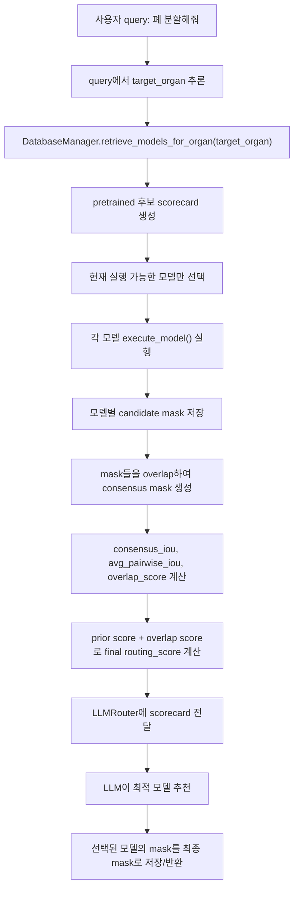

# LLM 장기별 마스크 Overlap 에이전트 흐름

## 1. 최종 목표

최종 목표는 GT를 모르는 inference 상황에서도 LLM이 폐 또는 심장 같은 타깃 장기별 분석 에이전트처럼 동작하게 만드는 것이다.

사용자가 다음처럼 요청하면:

```text
폐 분할해줘
```

pipeline은 다음 순서로 동작한다.

1. query에서 타깃 장기를 추론한다.
   - `폐`, `lung`, `lungs` → `lung`
   - `심장`, `heart`, `cardiac` → `heart`
2. 해당 장기에 맞는 pretrained 후보 모델을 registry에서 가져온다.
3. 현재 코드에서 실행 가능한 모델들이 각각 segmentation mask를 생성한다.
4. 생성된 mask들을 서로 overlap해서 consensus score를 계산한다.
5. 모델별 prior score와 overlap score를 LLM에 전달한다.
6. LLM이 최종적으로 가장 적합한 모델을 추천한다.
7. 추천된 모델이 생성한 mask를 최종 mask로 반환한다.

즉, LLM은 segmentation model 자체가 아니라 모델 선택과 결과 해석을 담당하는 organ-specific orchestrator이다.

## 2. 사전학습 미확인 모델 제외

원본 weight가 없거나 pretrained weight 존재 여부가 검증되지 않은 모델은 registry에서 제외했다.

제외한 모델:

| 모델 | 제외 이유 |
|---|---|
| `IlliaOvcharenko/lung-segmentation` | 원본 weight 파일 존재 여부를 검증하지 못함 |
| `sam_med2d_box_prompt` | 현재 local checkpoint가 없고 장기 전용 pretrained 후보로 쓰기 어려움 |

Fallback metadata에서도 untrained architecture 후보를 제거했다.

제거한 fallback 후보:

- `medsam`
- `segresnet_lung`
- `attention_unet_lung`

## 3. 현재 실제 실행 가능한 후보

### 폐 에이전트

현재 `lung` 요청에서 실제로 실행 가능한 pretrained 후보:

| 모델 | 원본 | 역할 |
|---|---|---|
| `cxr_basic_anatomy_lung` | `ianpan/chest-x-ray-basic` | right lung + left lung union mask |
| `torchxrayvision_pspnet_lung` | `mlmed/torchxrayvision ChestX-Det PSPNet` | left/right lung channel union mask |

### 심장 에이전트

현재 `heart` 요청에서 실제로 실행 가능한 pretrained 후보:

| 모델 | 원본 | 역할 |
|---|---|---|
| `cxr_basic_anatomy_heart` | `ianpan/chest-x-ray-basic` | heart label mask |
| `torchxrayvision_pspnet_heart` | `mlmed/torchxrayvision ChestX-Det PSPNet` | Heart channel mask |

OpenCXR, HybridGNet, CXAS 등은 pretrained weight를 받을 수는 있지만 현재 adapter 또는 package/weight setup이 끝나지 않았으므로 `selection_enabled=false` 상태로 둔다.

## 4. 모델별 score 구성

LLM에 넘기는 최종 score는 두 종류의 정보를 합친다.

### 4.1 Prior score

Registry에 저장된 기존 검증 성능을 기반으로 한다.

```text
prior_routing_score = 0.7 * DSC + 0.3 * IoU
```

이 값은 “이 모델이 과거 검증에서 어느 정도 좋았는가”를 나타낸다.

### 4.2 Mask overlap score

GT가 없는 상황에서 모델들이 만든 mask끼리 얼마나 합의하는지를 본다.

계산 항목:

- `consensus_iou`: 해당 모델 mask와 consensus mask의 IoU
- `consensus_dsc`: 해당 모델 mask와 consensus mask의 Dice
- `avg_pairwise_iou`: 다른 모델 mask들과의 평균 IoU
- `mask_area_fraction`: 이미지 전체에서 mask가 차지하는 비율
- `mask_empty`: 빈 mask 여부

Overlap score는 다음처럼 계산한다.

```text
overlap_score = 0.7 * consensus_iou + 0.3 * avg_pairwise_iou
```

빈 mask이면 score를 0으로 둔다.

### 4.3 최종 routing score

모델이 2개 이상 성공적으로 실행된 경우:

```text
final_routing_score = 0.6 * prior_routing_score + 0.4 * overlap_score
```

모델이 1개만 성공한 경우:

```text
final_routing_score = prior_routing_score
```

이 최종 score가 LLM에 전달되고, LLM은 이 score와 mask overlap 근거를 보고 최종 모델을 고른다.

## 5. 코드 흐름



## 6. 변경된 주요 파일

### `configs/model_registry.json`

- 사전학습 미확인 모델 제거
- 실행 가능한 lung/heart 모델에 metadata 보강
- `weight_status`, `weight_action` 유지
- `selection_enabled=true`는 현재 실행 가능하고 LLM이 선택 가능한 모델에만 부여

### `model_comparison/main.py`

변경된 역할:

- query에서 `lung` 또는 `heart` 추론
- GT가 없어도 여러 모델을 먼저 실행
- 후보별 mask 저장
- consensus mask 생성
- overlap score 계산
- score가 추가된 candidate scorecard를 LLM에 전달
- LLM이 선택한 모델 mask를 최종 반환

### `model_comparison/llm_router.py`

변경된 역할:

- LLM prompt에 prior score와 mask overlap score를 함께 제공
- `execution_status=success`인 모델만 선택하도록 안내
- `selection_enabled=false`, error, zero score 모델은 선택하지 않도록 안내
- fallback/guardrail도 최종 `routing_score` 기준으로 동작

### `model_comparison/database_manager.py`

변경된 역할:

- `pretrained_weight_available=false` 모델은 registry에서 로드하지 않음
- fallback 후보에서 untrained model 제거
- `weight_status`, `weight_action`을 LLM scorecard까지 전달

## 7. 결과 JSON에서 확인할 수 있는 값

Pipeline 결과에는 다음 값이 저장된다.

| 필드 | 의미 |
|---|---|
| `selected_model` | LLM이 최종 선택한 모델 |
| `selected_score` | 최종 routing score |
| `mask_path` | 최종 선택 모델의 mask |
| `candidate_mask_paths` | 실행된 모델별 mask 경로 |
| `consensus_mask_path` | 모델 mask overlap으로 만든 consensus mask |
| `candidate_scorecard` | LLM에 전달된 모델별 scorecard |
| `overlap_scores` | 모델별 overlap score |
| `router_reason` | LLM 또는 fallback이 선택한 이유 |

## 8. 현재 한계

현재 바로 실행 가능한 pretrained 모델은 폐 2개, 심장 2개이다. OpenCXR, HybridGNet, CXAS 같은 모델은 weight나 adapter 작업이 끝나면 같은 구조에 자연스럽게 연결할 수 있다.

중요한 점은 GT가 없는 상황에서는 “정답과의 정확도”를 계산할 수 없다는 것이다. 따라서 현재 구조는 다음 두 근거를 합쳐 최적 모델을 고른다.

1. 과거 검증 성능 기반 prior score
2. 현재 입력 이미지에서 모델 mask들 간 overlap/consensus score

이 구조가 교수님이 요청한 “GT 없이도 어떤 패턴에 어떤 모델을 써야 하는지 LLM이 판단하는 장기별 에이전트” 구조에 해당한다.
